<h2>TensorFlow-FlexUNet-Image-Segmentation-Hippocampus-MRI (2026/03/27)</h2>
Sarah T. Arai 
Software Laboratory antillia.com  
This is the first experiment of Image Segmentation for <b>Hippocampus-MRI</b> (<b>K</b>idney <b>PA</b>rsing Challenge 20<b>22</b>) 
 based on 
our <a href="./src/TensorFlowFlexUNet.py">TensorFlowFlexUNet</a>
 (<b>TensorFlow Flexible UNet Image Segmentation Model for Multiclass</b>), and a 256x256 pixels PNG
 <a href="https://drive.google.com/file/d/19ffHyLZMK4XQsDU7aLeV8efML0o3G6jv/view?usp=sharing">
Hippocampus-MRI-Image-SmoothedMask-Dataset.zip</a> 
(<a href="https://creativecommons.org/licenses/by-sa/4.0/">
CC BY-SA 4.0
</a>), which was derived by us from   
<a href="https://www.kaggle.com/datasets/ag3ntsp1d3rx/hippocampus">
<b>Hippocampus MRI Slices</b>
</a> on the kaggle.com
  

<b>Actual Image Segmentation for Hippocampus-MRI Images of 256x256 pixels</b> 
As shown below, the inferred masks predicted by our segmentation model trained by the dataset appear similar to the 
ground truth masks, but they lack precision in certain areas.
  
<b> class_color_map = {Anterior:cyan,  Posterior:yellow }</b>
  
<table>
<tr>
<th>Input: image</th>
<th>Mask (ground_truth)</th>
<th>Prediction: inferred_mask</th>
</tr>
<tr>
<td>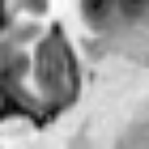</td>
<td></td>
<td></td>
</tr>

<tr>
<td>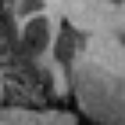</td>
<td></td>
<td></td>
</tr>

<tr>
<td>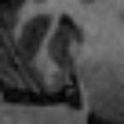</td>
<td></td>
<td>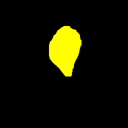</td>
</tr>
</table>

 
<h3>1. Dataset Citation</h3>
The dataset used here was taken from   
<a href="https://www.kaggle.com/datasets/ag3ntsp1d3rx/hippocampus">
<b>Hippocampus MRI Slices</b>
</a> on the kaggle.com
  
The following explanation was taken from the above kaggle web site.  
<b>About Dataset</b> 
High-resolution MRI hippocampus images and segmentation masks derived from the Medical Segmentation Decathlon challenge.
  
File Information: 
<ul>
<li>images/ – Percentile-normalized MRI slices (0–1 float32 TIFF) resized to 256×256, coronal view.</li>
<li>labels/Anterior – Binary segmentation masks for anterior hippocampus (uint8 {0,255} TIFF).</li>
<li>labels/Posterior – Binary segmentation masks for posterior hippocampus (uint8 {0,255} TIFF).</li>
</ul>
 
Filenames follow the format: 
<ul>
<li>Volume-<case_id>-<slice_id>.tiff # MRI image slice</li>
<li>Label-<case_id>-<slice_id>.tiff # Corresponding segmentation mask</li>
</ul>
 
<b>License</b> 
<a href="https://creativecommons.org/licenses/by-sa/4.0/">
CC BY-SA 4.0</a>
 
 
<h3>
<a id="2">
2 Hippocampus-MRI ImageMask Dataset
</a>
</h3>
<h3>2.1 Download ImageMask Dataset</h3>
 If you would like to train this Hippocampus-MRI Segmentation model by yourself,
 please download the dataset from the google drive  
 <a href="https://drive.google.com/file/d/19ffHyLZMK4XQsDU7aLeV8efML0o3G6jv/view?usp=sharing">
Hippocampus-MRI-Image-SmoothedMask-Dataset.zip</a> (<a href="https://interoperable-europe.ec.europa.eu/licence/creative-commons-attribution-40-international-cc-40">
CC BY 4.0
</a>)
, expand the downloaded ImageMaskDataset and put it under <b>./dataset</b> folder to be
 
<pre>
./dataset
└─Hippocampus-MRI
    ├─test
    │   ├─images
    │   └─masks
    ├─train
    │   ├─images
    │   └─masks
    └─valid
        ├─images
        └─masks
</pre>
 
<b>Hippocampus-MRI Statistics</b> 
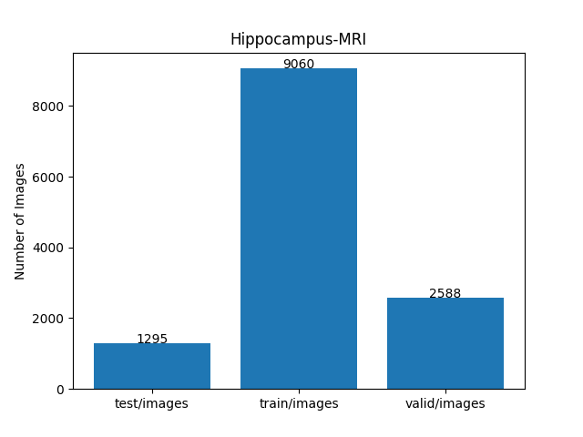 
  
As shown above, the number of images of train and valid datasets is large enough to use for the
 training set of our segmentation model.
  
<h3>2.2 Smoothing Masks</h3>
<b>A. Orignal colorized masks</b> 
<image src="./projects/TensorFlowFlexUNet/Hippocampus-MRI/asset/original_mask_sample.png" width="1024" height="auto"> 
 
As illustrated above, the masks generated from the original TIFF files feature sharp-edged filled polygons,
 making them unsuitable for ground truth data. To address this, we used a simple Python script to create a new 
 PNG dataset with slightly smoothed, colorized masks.
  
<b>B. Smoothed colorized masks</b> 
<image src="./projects/TensorFlowFlexUNet/Hippocampus-MRI/asset/smoothed_mask_sample.png" width="1024" height="auto"> 
 
 
<h3>2.3 Train Image and SmoothedMask Saｍples</h3>
<b>Train_images_sample</b> 
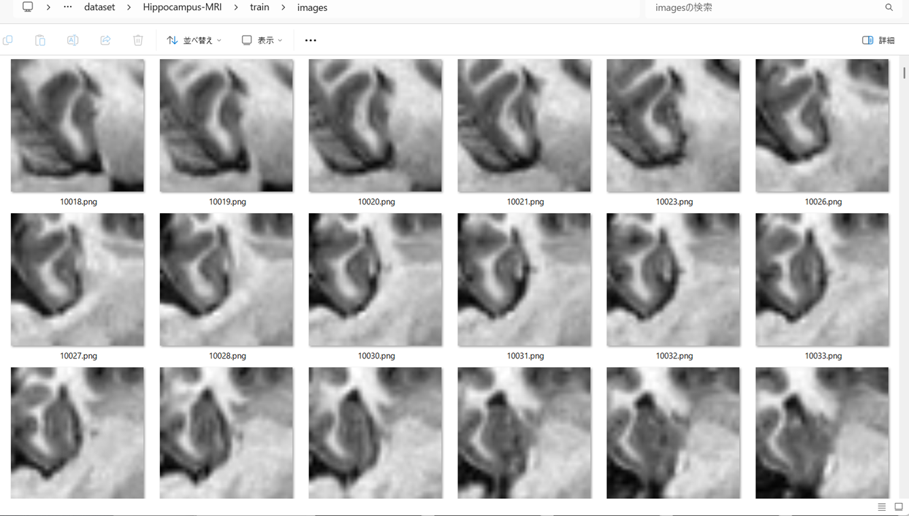
 
<b>Train_masks_sample</b> 
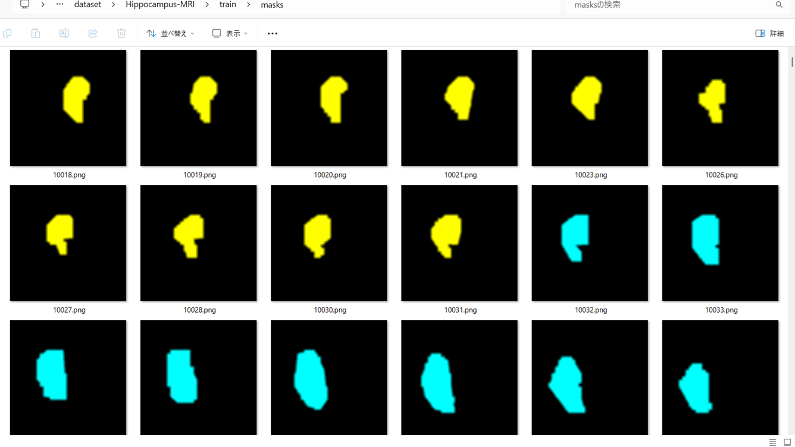
 
<h3>
3 Train TensorFlowFlexUNet Model
</h3>
 We trained Hippocampus-MRI TensorFlowFlexUNet Model by using the 
<a href="./projects/TensorFlowFlexUNet/Hippocampus-MRI/train_eval_infer.config"> <b>train_eval_infer.config</b></a> file.  
Please move to ./projects/TensorFlowFlexUNet/Hippocampus-MRI and run the following bat file. 
<pre>
>1.train.bat
</pre>
, which simply runs the following command. 
<pre>
>python ../../../src/TensorFlowFlexUNetTrainer.py ./train_eval_infer.config
</pre>

<b>Model parameters</b> 
Defined a small <b>base_filters = 16 </b> and large <b>base_kernels = (9,9)</b> for the first Conv Layer of Encoder Block of 
<a href="./src/TensorFlowFlexUNet.py">TensorFlowFlexUNet.py</a> 
and a large num_layers (including a bridge between Encoder and Decoder Blocks).
<pre>
[model]
;You may specify your own UNet class derived from our TensorFlowFlexModel
model         = "TensorFlowFlexUNet"
image_width    = 256
image_height   = 256
image_channels = 3
input_normalize = True
normalization  = False
num_classes    = 5
base_filters   = 16
base_kernels   = (11,11)
num_layers     = 8
dropout_rate   = 0.05
dilation       = (1,1)
</pre>
<b>Learning rate</b> 
Defined a small learning rate.  
<pre>
[model]
learning_rate  = 0.00007
</pre>
<b>Loss and metrics functions</b> 
Specified "categorical_crossentropy" and <a href="./src/dice_coef_multiclass.py">"dice_coef_multiclass"</a>. 
<pre>
[model]
loss           = "categorical_crossentropy"
metrics        = ["dice_coef_multiclass"]
</pre>
<b>Dataset class</b> 
Specifed <a href="./src/ImageCategorizedMaskDataset.py">ImageCategorizedMaskDataset</a> class. 
<pre>
[dataset]
class_name    = "ImageCategorizedMaskDataset"
</pre>
 
<b>Learning rate reducer callback</b> 
Enabled learing_rate_reducer callback, and a small reducer_patience.
<pre> 
[train]
learning_rate_reducer = True
reducer_factor     = 0.4
reducer_patience   = 4
</pre>
<b>Early stopping callback</b> 
Enabled early stopping callback with patience parameter.
<pre>
[train]
patience      = 10
</pre>
<b>RGB Color map</b> 
Specifed rgb color map dict for Hippocampus-MRI 1+4 classes. 
<pre>
[mask]
mask_datatyoe    = "categorized"
mask_file_format = ".png"
;Hippocampus-MRI rgb color map dict for 1+2 classes.
rgb_map = {(0,0,0):0, (0,255,255):1,(255,255,0):2, }
</pre>
<b>Epoch change inference callback</b> 
Enabled <a href="./src/EpochChangeInferencer.py">epoch_change_infer callback</a></b>. 
<pre>
[train]
epoch_change_infer       = True
epoch_change_infer_dir   =  "./epoch_change_infer"
num_infer_images         = 6
</pre>
By using this callback, on every epoch_change, the inference procedure can be called
 for 6 images in <b>mini_test</b> folder. This will help you confirm how the predicted mask changes 
 at each epoch during your training process.  
  
As shown below, early in the model training, the predicted masks from our UNet segmentation model showed 
discouraging results.
 However, as training progressed through the epochs, the predictions gradually improved. 
   
 
<b>Epoch_change_inference output at starting (epoch 1,2,3)</b> 
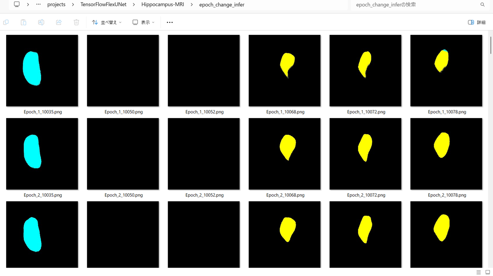 
 
<b>Epoch_change_inference output at middlepoint (epoch 10,11,12)</b> 
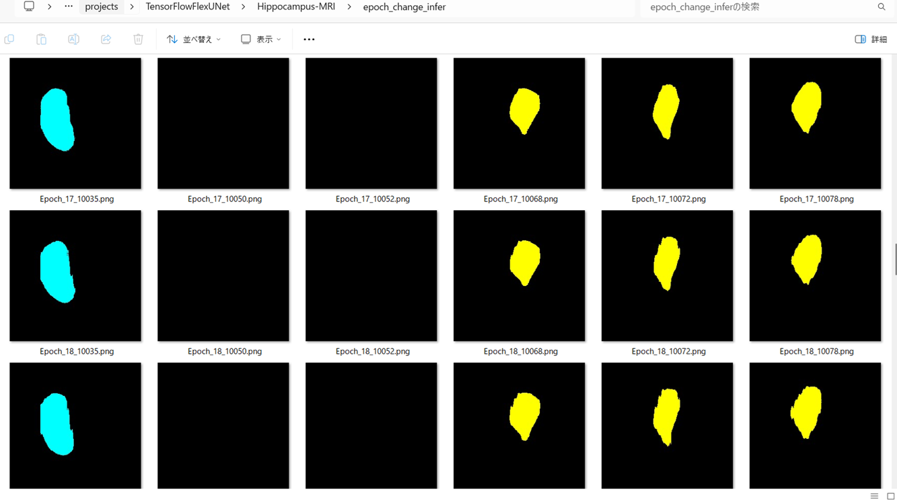 
 

<b>Epoch_change_inference output at ending (epoch 22,23,24)</b> 
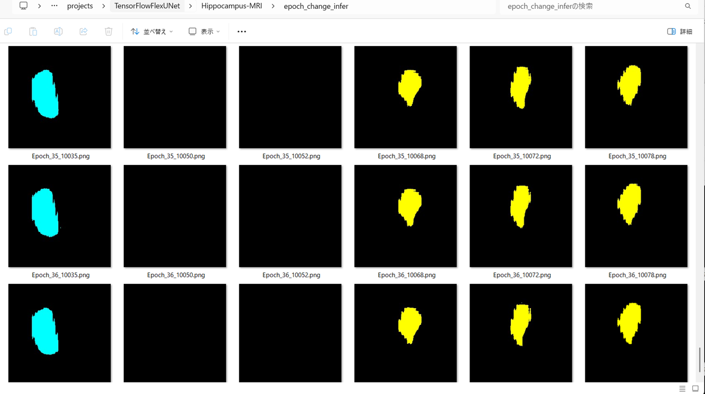 
 

In this experiment, the training process was stopped at epoch 24 by EarlyStopping callback.  
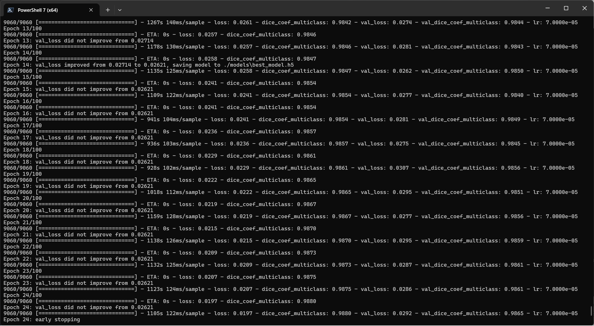 
 

<a href="./projects/TensorFlowFlexUNet/Hippocampus-MRI/eval/train_metrics.csv">train_metrics.csv</a> 
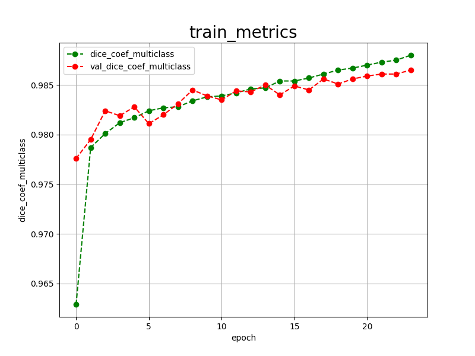 

 
<a href="./projects/TensorFlowFlexUNet/Hippocampus-MRI/eval/train_losses.csv">train_losses.csv</a> 
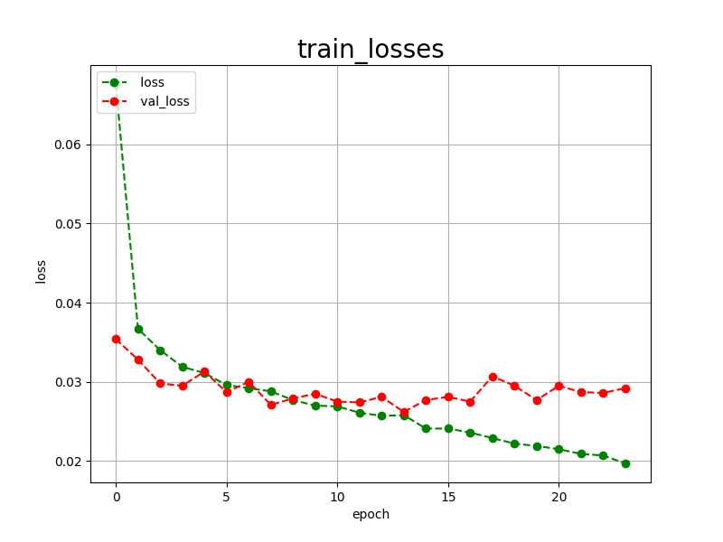 
 
<h3>
4 Evaluation
</h3>
Please move to <b>./projects/TensorFlowFlexUNet/Hippocampus-MRI</b> folder, 
and run the following bat file to evaluate TensorFlowUNet model for Hippocampus-MRI. 
<pre>
./2.evaluate.bat
</pre>
This bat file simply runs the following command.
<pre>
python ../../../src/TensorFlowFlexUNetEvaluator.py ./train_eval_infer_aug.config
</pre>

Evaluation console output: 
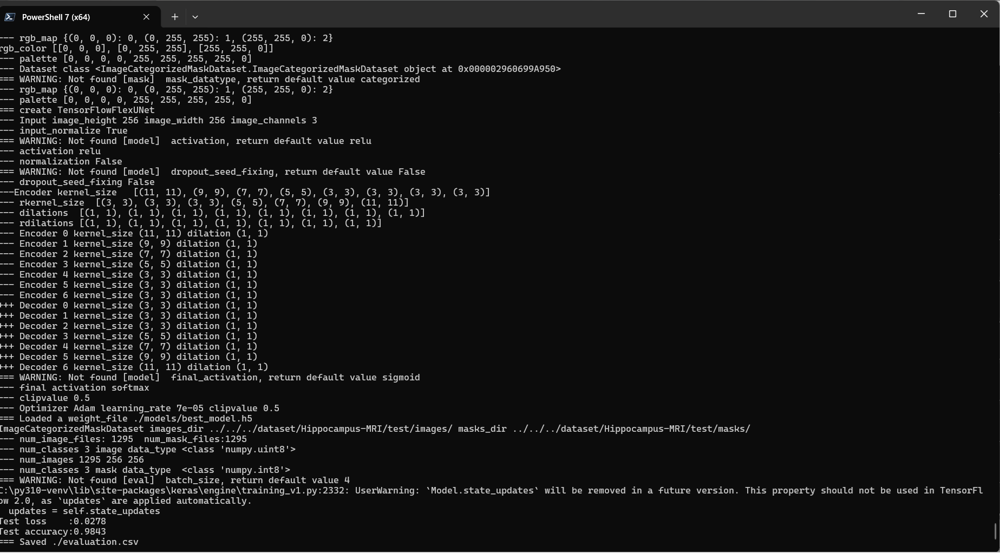
  Image-Segmentation-Hippocampus-MRI

<a href="./projects/TensorFlowFlexUNet/Hippocampus-MRI/evaluation.csv">evaluation.csv</a> 
The loss (categorical_crossentropy) to this <b>Hippocampus-MRI/test</b> was low, and dice_coef_multiclass was high as shown below.
 
<pre>
categorical_crossentropy,0.0278
dice_coef_multiclass,0.9843
</pre>
 
<h3>
5 Inference
</h3>
Please move to a <b>./projects/TensorFlowFlexUNet/Hippocampus-MRI</b> folder, and run the following bat file to infer segmentation regions for images by the Trained-TensorFlowUNet model for Hippocampus-MRI. 
<pre>
./3.infer.bat
</pre>
This simply runs the following command.
<pre>
python ../../../src/TensorFlowFlexUNetInferencer.py ./train_eval_infer_aug.config
</pre>

<b>mini_test_images</b> 
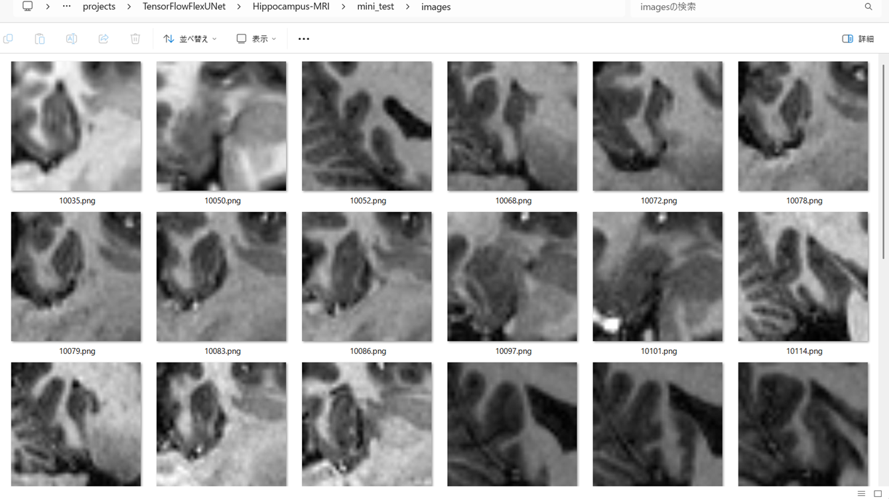 
<b>mini_test_mask(ground_truth)</b> 
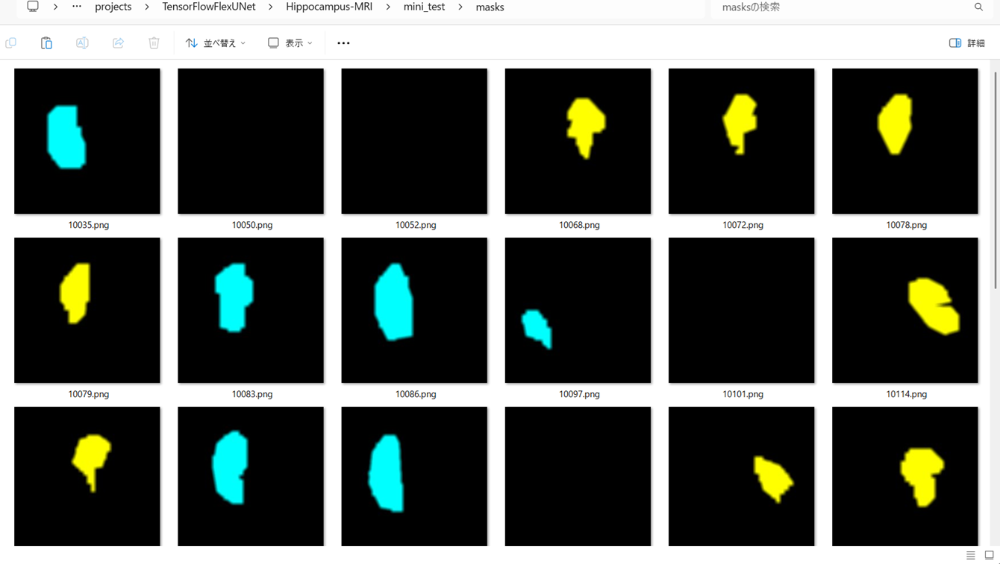 

<b>Inferred test masks</b> 
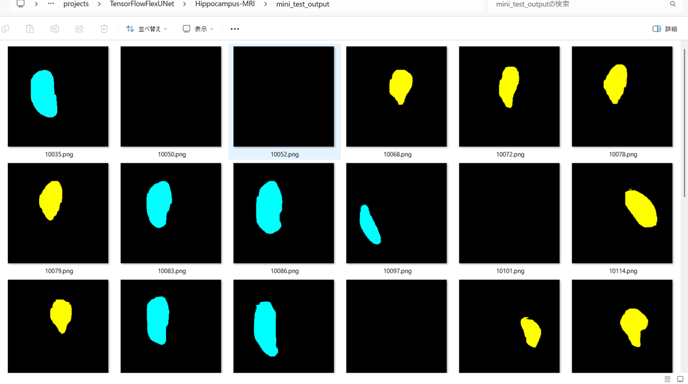 
 

<b>Enlarged images and masks of Hippocampus-MRI Images of 256x256 pixels</b> 
As shown below, the inferred masks predicted by our segmentation model trained by the dataset appear similar to the ,
ground truth masks, but they lack precision in certain areas.
  
<b> class_color_map = {Anterior:cyan,  Posterior:yellow }</b>
  
<table>
<tr>
<th>Image</th>
<th>Mask (ground_truth)</th>
<th>Inferred-mask</th>
</tr>
<tr>
<td>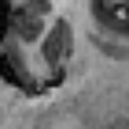</td>
<td></td>
<td>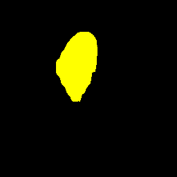</td>
</tr>

<tr>
<td>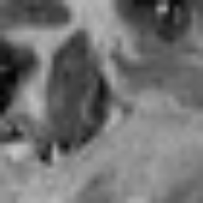</td>
<td></td>
<td>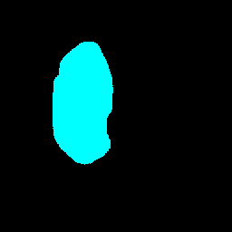</td>
</tr>

<tr>
<td>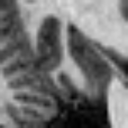</td>
<td></td>
<td>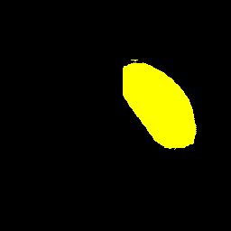</td>
</tr>

<tr>
<td>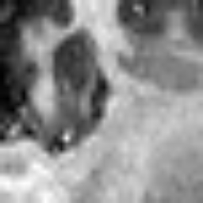</td>
<td></td>
<td></td>
</tr>

<tr>
<td>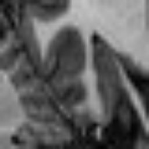</td>
<td></td>
<td>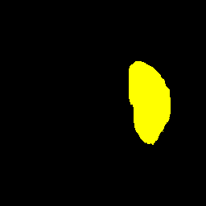</td>
</tr>

<tr>
<td>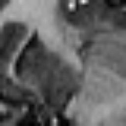</td>
<td></td>
<td></td>
</tr>
</table>

 
<h3>
References
</h3>
<b>1. DATASET OF MAGNETIC RESONANCE IMAGES OF NONEPILEPTIC SUBJECTS AND TEMPORAL LOBE EPILEPSY PATIENTS 
FOR VALIDATION OF HIPPOCAMPAL SEGMENTATION TECHNIQUES</b> 
Kourosh Jafari-Khouzani, Kost V Elisevich, Suresh Patel, Hamid Soltanian-Zadeh  
<a href="https://pmc.ncbi.nlm.nih.gov/articles/PMC4501402/">
https://pmc.ncbi.nlm.nih.gov/articles/PMC4501402/</a>
  
<b>2.  Hippocampus Segmentation Using U-Net Convolutional Network from Brain Magnetic Resonance Imaging (MRI)</b> 
Ruhul Amin Hazarika, Arnab Kumar Maji, Raplang Syiem, Samarendra Nath Sur, Debdatta Kandar  
<a href="https://pmc.ncbi.nlm.nih.gov/articles/PMC9485390/">
https://pmc.ncbi.nlm.nih.gov/articles/PMC9485390/</a>
  
<b>3. Fully Automated Hippocampus Segmentation using T2-informed Deep Convolutional Neural Networks</b> 
Maximilian Sackl, Christian Tinauer, Martin Urschler, Christian Enzinger, Rudolf Stollberger, Stefan Ropele  
<a href="https://www.sciencedirect.com/science/article/pii/S1053811924002647">
https://www.sciencedirect.com/science/article/pii/S1053811924002647</a>
  
<b>4. TensorFlow-FlexUNet-Image-Segmentation-MSD-Hippocampus</b> 
Toshiyuki Arai  
<a href="https://github.com/sarah-antillia/TensorFlow-FlexUNet-Image-Segmentation-MSD-Hippocampus">
https://github.com/sarah-antillia/TensorFlow-FlexUNet-Image-Segmentation-MSD-Hippocampus
</a>
 
 
<b>5. TensorFlow-FlexUNet-Image-Segmentation-Hippocampus-T1W</b> 
Toshiyuki Arai  
<a href="https://github.com/sarah-antillia/TensorFlow-FlexUNet-Image-Segmentation-Hippocampus-T1W">
https://github.com/sarah-antillia/TensorFlow-FlexUNet-Image-Segmentation-Hippocampus-T1W
</a>
 
 
<b>6. TensorFlow-FlexUNet-Image-Segmentation-Model</b> 
Toshiyuki Arai  
<a href="https://github.com/sarah-antillia/TensorFlow-FlexUNet-Image-Segmentation-Model">
TensorFlow-FlexUNet-Image-Segmentation-Model
</a>
 
 
